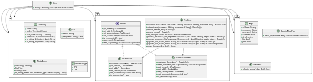

# tree-ftp

## Introduction

`tree-ftp` is an FTP client written in Rust, designed to provide a simple and efficient interface for interacting with FTP servers.
It allows users to connect to an FTP server and generate a tree structure of the server's directories and files.

## Installation

### Prerequisites

- rust
- Docker

### Steps

1. Clone the repository:

    ```sh
    git clone https://gitlab.univ-lille.fr/thibault.tisserand.etu/sr1-tp1-tisserand
    cd sr1-tp1-tisserand
    ```

## Rust Compilation

To compile the project using Rust, run the following command:

```sh
cargo build --release
```

## Docker Compilation

1. To build the Docker image, run the following command:

    ```sh
    docker build -t tree-ftp .
    ```

2. Start the FTP server dependency:

    ```sh
    docker run -d \
        --name ftp-server \
        -p "21:21" \
        -p 21000-21010:21000-21010 \
        -e USERS="one|1234" \
        -e ADDRESS=localhost \
        delfer/alpine-ftp-server
    ```

3. Run the `tree-ftp` command using Docker:

    ```sh
    docker run --rm --network host tree-ftp localhost -u one -p 1234
    ```

## Docker Compose

1. To build the Docker compose, run the following command:

    ```sh
    docker-compose build
    ```

2. Run the following command to start the services:

    ```sh
    docker-compose up -d
    ```

3. To run the `tree-ftp` command using Docker Compose, use the following command:

    ```sh
    docker-compose run --rm tree-ftp localhost -u one -p 1234
    ```

## Generating Documentation

To generate the Rust documentation for this project, run the following command:

```sh
cargo doc --open
```

## Demo Videos

You can watch the demo videos below:

<video width="600" controls>
  <source src="assets/demo.mp4" type="video/mp4">
  Your browser does not support the video tag.
</video>

## Class diagram



## Code Samples

### 1. Interesting Algorithm

The `process_responses_dfs` method in `src/ftp/client.rs` uses a depth-first search (DFS) algorithm to process server responses and populate a directory up to a specified depth using references to populate directory.

```rust
fn process_responses_dfs(
    &mut self,
    responses: Responses,
    dir: &mut Directory,
    depth: usize,
) -> Result<()> {
    for response in responses {
        if self.ftp_stream.is_reconnected() {
            return Ok(());
        }

        let (code, line) = response;
        let node_name = Self::parse_filename(&line);

        if line.chars().next() == Some('d') {
            let mut subdir = Directory::new(node_name.clone());

            if code < 500 && depth > 0 {
                self.populate_dir_dfs(node_name.clone(), &mut subdir, depth - 1)?;
            }

            dir.add(subdir);
        } else {
            dir.add(File::new(node_name));
        }
    }

    Ok(())
}
```

### 2. Design Pattern Interface

The design pattern used here is the interface pattern. The `DataStream` and `CommandStream` classes implement the `Stream` interface in `stream.rs`.

```rust
pub trait Stream {
    fn get_stream(&self) -> &TcpStream;
    fn get_addr(&self) -> SocketAddr;
    fn set_stream(&mut self, stream: TcpStream);
    fn set_reconnected(&mut self, reconnected: bool);
    fn is_reconnected(&mut self) -> bool;
    fn reconnect(&mut self) -> Result<bool>;
    fn read_responses(&mut self) -> Result<Vec<Response>>;
}
```

### 3. Result Type and Errors

The `Result` type and `Error` enum in `src/ftp/error.rs` represent various errors that can occur during FTP operations.
An `Result` is returning ̀`Ok(value)` or `Err(err)` that make easier the error handling.

```rust
use derive_more::From;

pub type Result<T> = core::result::Result<T, Error>;

/// Represents various errors that can occur during FTP operations.
#[derive(Debug, From)]
pub enum Error {
    /// Error occurred while reading data.
    ReadError,
    /// Error occurred while attempting to reconnect.
    ReconnectError,
    /// Error occurred while establishing a connection.
    ConnectionError,
    /// Error occurred while resolving the domain.
    DomainResolutionError,
    /// Error occurred while writing a command.
    CommandWriteError,
    /// Error occurred while flushing a command.
    CommandFlushError,
    /// Error occurred due to invalid parsed data.
    InvalidParsedData,
    /// Error occurred due to invalid parsed IP address.
    InvalidParsedIp,
    /// Error occurred due to invalid parsed port.
    InvalidParsedPort,
    /// No response was received.
    NoResponseReceived,
}

impl core::fmt::Display for Error {
    fn fmt(&self, fmt: &mut core::fmt::Formatter) -> core::result::Result<(), core::fmt::Error> {
        write!(fmt, "{self:?}")
    }
}

impl std::error::Error for Error {}
```

### 4. TOML Optimization

The `Cargo.toml` file contains optimizations to reduce the binary size and improve performance.

```toml
[profile.release]
opt-level = "z"     # Optimize for size
lto = true          # Enable link-time optimization
codegen-units = 1   # Reduce number of codegen units to increase optimizations
panic = "abort"     # Abort on panic
strip = true        # Strip symbols from binary
```

### 5. Serialization with `serde`

The `Directory` struct in `src/fs/directory.rs` implements the `Serialize` trait from `serde` to allow serialization of directories and their contents using pattern matching on fs structs.

```rust
impl Serialize for Directory {
    fn serialize<S>(&self, serializer: S) -> Result<S::Ok, S::Error>
    where
        S: Serializer,
    {
        let mut map = serializer.serialize_map(Some(self.nodes.len()))?;

        for node in &self.nodes {
            match node {
                NodeEnum::Directory(dir) => {
                    map.serialize_entry(&dir.name, dir)?;
                }
                NodeEnum::File(file) => {
                    map.serialize_entry(&file.name, file)?;
                }
            }
        }

        map.end()
    }
}
```

### 6. Using `From` for `NodeEnum` to Avoid Big Lines

The `From` trait is implemented for `NodeEnum` to allow easy conversion from `File` and `Directory` to `NodeEnum`, avoiding long lines of code.

```rust
impl From<File> for NodeEnum {
    fn from(file: File) -> Self {
        NodeEnum::File(file)
    }
}

impl From<Directory> for NodeEnum {
    fn from(directory: Directory) -> Self {
        NodeEnum::Directory(directory)
    }
}
```

Before:

```rust
let node_file: NodeEnum = NodeEnum::File(File::new("example.txt"));
let node_directory: NodeEnum = NodeEnum::Directory(Directory::new("example_dir"));
```

After:

```rust
let node_file: NodeEnum = File::new("example.txt").into();
let node_directory: NodeEnum = Directory::new("example_dir").into();
```
